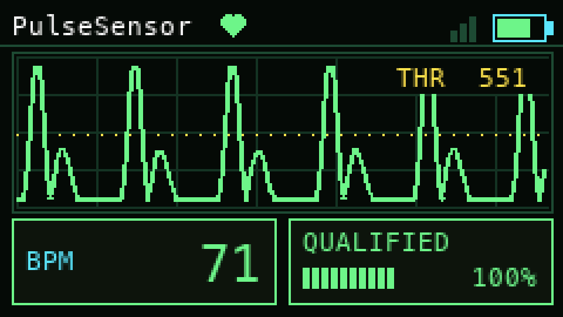
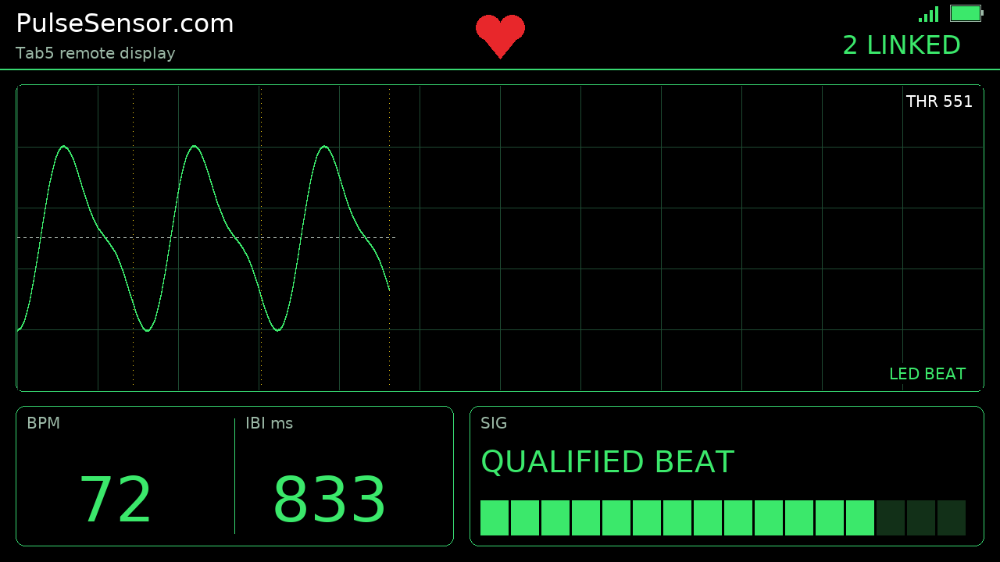
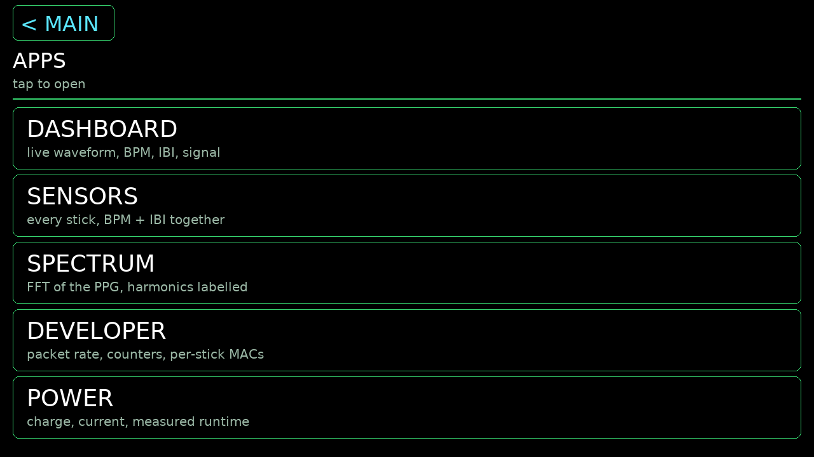
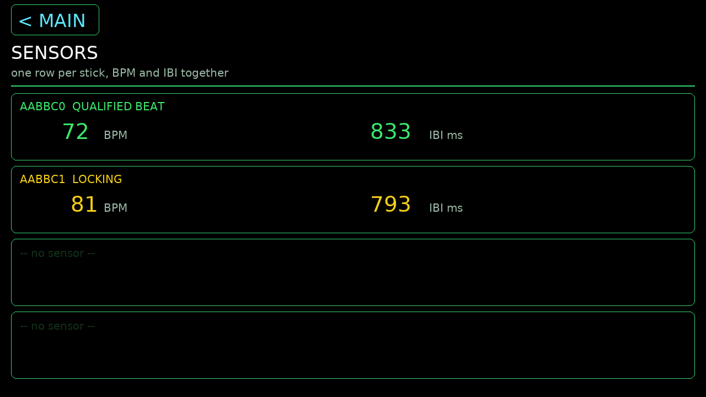
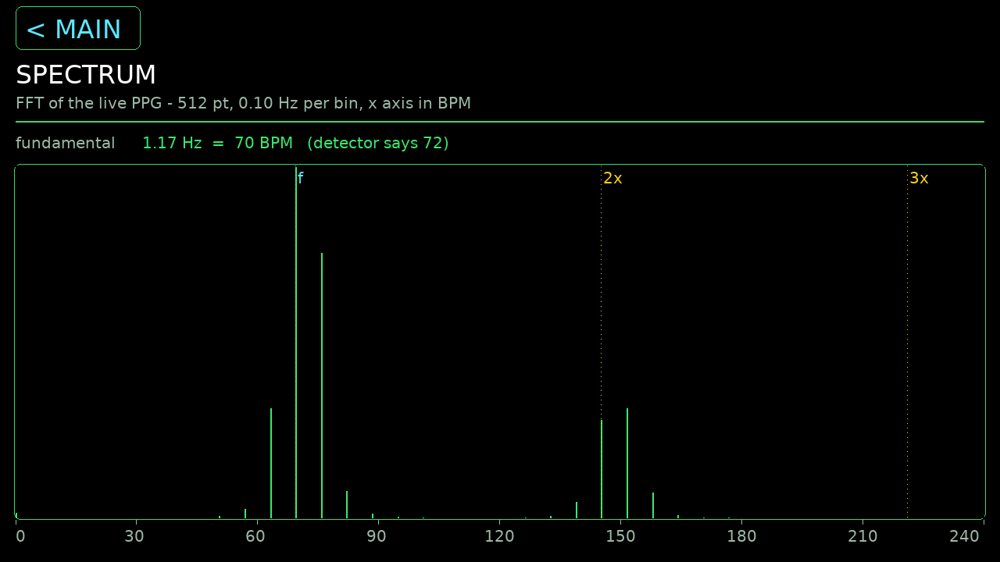
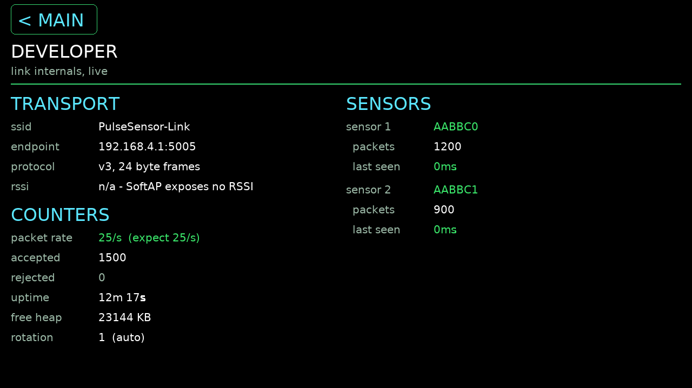
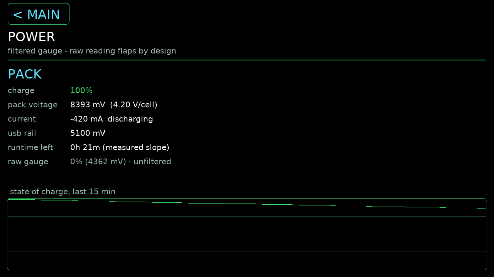
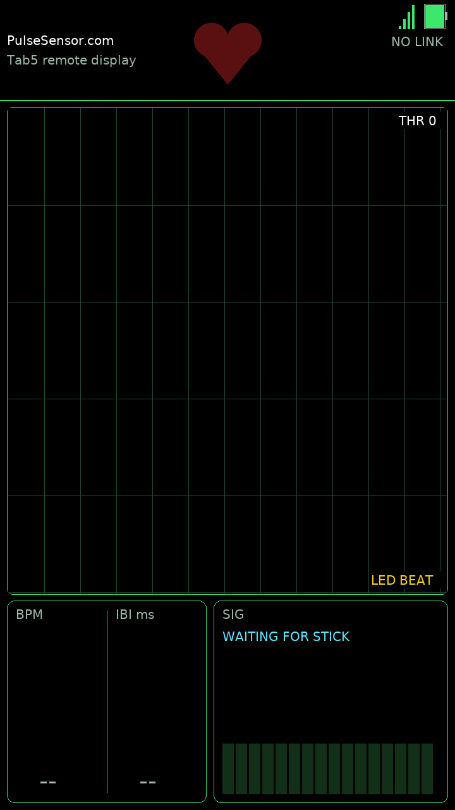

# PulseLink: Watch Your Heartbeat Come Alive on M5Stack StickS3



PulseLink turns the pocket-sized **M5Stack StickS3** into a self-contained
PulseSensor display with a live waveform, honest signal-confidence coaching,
and beat-synced BPM. No phone, cloud, router, breadboard, or second processor is
required.

- **Hackster build guide:**
  [PulseLink: Watch Your Heartbeat on M5Stack StickS3](https://www.hackster.io/YuryG_PulseSensor/pulselink-watch-your-heartbeat-on-m5stack-sticks3-400fe5)
- **M5Stack controller:**
  [StickS3 documentation](https://docs.m5stack.com/en/core/StickS3)
- **Sensor:**
  [PulseSensor Amped kit](https://pulsesensor.com/products/pulse-sensor-amped)
- **Room-scale remote display:**
  [M5Stack Tab5 companion](#companion-the-m5stack-tab5-remote-display) — live
  waveform, spectrum analyzer, and multi-sensor view over a private Wi-Fi link

## Why StickS3 is the heart of PulseLink

The StickS3 combines the parts this project needs in one polished controller:
an ESP32-S3, a sharp 1.14-inch display, battery power, programmable buttons,
accessible GPIO, and UIFlow2 MicroPython. It samples the PulseSensor on GPIO2,
runs adaptive beat detection and confidence logic, and renders the complete
240 × 135 interface at the same time.

The front button becomes **RESYNC**, the side button performs a detector reset,
and the battery makes the experience portable. StickS3 also offers Wi-Fi, an
IMU, audio, and a much broader development platform, but PulseLink deliberately
keeps the verified build local and focused: sensing, interpretation, feedback,
and display all happen on the controller.

## What makes PulseLink different

Many heartbeat projects jump directly from a noisy signal to a confident-looking
number. PulseLink keeps the waveform visible and makes uncertainty part of the
interface:

| State | Meaning |
|---|---|
| **Blue** | Collecting data; nothing trustworthy yet |
| **Yellow** | A pulse-like waveform is present; confidence is building |
| **Green** | The signal is qualified and BPM is ready |

The waveform, heart, confidence state, and BPM tile share this color language.
Every accepted beat animates the heart and BPM tile. RESYNC lets the user retune
detection to the signal already visible on screen.

## Hardware

| Quantity | Component | Purpose |
|---:|---|---|
| 1 | M5Stack StickS3 | Samples, processes, and displays the signal |
| 1 | [PulseSensor Amped kit](https://pulsesensor.com/products/pulse-sensor-amped) | Captures the optical pulse waveform |

That is the complete electronics list. The PulseSensor kit's black, red, and
purple leads plug directly onto the StickS3 header; no breadboard, adapter
harness, or additional jumper wires are needed.

### Wiring

Disconnect USB power before wiring.

| PulseSensor lead | StickS3 |
|---|---|
| Signal / purple | **G2 / GPIO2** |
| VCC / red | **3V3** |
| GND / black | **GND** |

Power the PulseSensor from **3.3 V only** in this build. Do not connect it to
5 V.

Before skin contact, apply the included transparent vinyl dot to the sensor face
and completely insulate the electronics on the back. Do not place exposed
electronics against skin.

## Software quick start

The verified build uses **UIFlow2 v2.4.9** on StickS3 and one readable
MicroPython application: [`pulselink.py`](pulselink.py).

1. Install or restore UIFlow2 v2.4.9 with M5Burner.
2. Install Python 3 and `mpremote`:

   ```bash
   python3 -m pip install mpremote
   ```

3. Clone this repository and copy the application to the StickS3 as `main.py`:

   ```bash
   git clone https://github.com/yury-g/pulsesensor-m5sticks3.git
   cd pulsesensor-m5sticks3
   python3 -m mpremote connect auto fs cp pulselink.py :main.py
   ```

4. Reset the StickS3. PulseLink should start automatically.

If UIFlow2 opens its launcher instead of `main.py`, set the UIFlow2 boot option
to run the downloaded program, then reset again.

## Using PulseLink

Rest a fingertip lightly on the prepared PulseSensor and hold still while the
detector builds confidence. Small changes in pressure or motion will be visible
in the waveform.

| Control | Action |
|---|---|
| Front blue button / BtnA | **RESYNC** — retune to the live waveform and open a short fast-lock period |
| Side button / BtnB | Perform a full detector reset |

## How it works

The StickS3 samples the analog signal at 50 Hz and reduces its 12-bit ADC
reading to the 10-bit range used by the detector. The detector follows the
running peak and trough, places an adaptive threshold between them, and uses a
refractory gate to prevent one physical pulse from being counted more than
once.

Possible beats must fall within the educational demo's interval, rate, and
amplitude limits. A confidence score rises for consistent beats and falls when
the signal becomes uncertain. BPM appears only after the score passes the
10-of-12 lock threshold, then uses up to ten recent qualified intervals for
smoothing.

The current code corresponds to the real-hardware-verified `v1.1-resync` build.
The finished application is [`pulselink.py`](pulselink.py). Earlier experiments
and filenames remain available through the public Git history and tags.

## Companion: the M5Stack Tab5 remote display

[`pulselink_tab5.py`](pulselink_tab5.py) turns an **M5Stack Tab5** (ESP32-P4,
1280 × 720) into a room-scale remote display for one or more StickS3 sensors.

The detector still runs on the stick. The Tab5 only renders what arrives — over
a private **SoftAP + UDP** link the two ends set up between themselves, with no
router, no cloud, and nothing for the user to configure. (The P4 has no radio of
its own and its Wi-Fi co-processor build has no ESP-NOW, so the link is UDP over
a SoftAP the Tab5 hosts.)



BPM and IBI share one window at a 104 px face — readable across a room — beside
a wider SIG panel carrying the signal coach. The waveform keeps the same colour
language as the stick: yellow while acquiring, green once the quality meter
locks.

### Tapping through

The header icons are the buttons. Tap the link bars, the battery, the title,
the waveform, or the BPM panel.

| | |
|---|---|
| <br>**APPS** — every screen, one tap away | <br>**SENSORS** — up to 4 sticks, BPM and IBI together on each row |
| <br>**SPECTRUM** — 512-point FFT of the live PPG, harmonics marked `f`/`2x`/`3x`, axis in BPM | <br>**DEVELOPER** — packet rate, accepted/rejected counters, per-stick ids, uptime, heap |
| <br>**POWER** — charge, cell voltage, current, and a runtime estimate from the *measured* discharge slope | <br>**AUTO-ROTATE** — the IMU picks the orientation and the whole layout is recomputed |

### About these images

**They are simulator renders, not device photographs or framebuffer captures.**
They come from [`tools/sim_tab5.py`](tools/sim_tab5.py), which stubs the M5 API
and runs the real application source unmodified.

The distinction is worth stating precisely, because half of it is trustworthy
and half is not:

- **Layout is real.** The simulator reproduces the font metrics measured on the
  actual panel, so the app's `fit()` logic selects exactly the faces the device
  selects. Positions, sizes and fit decisions are the device's.
- **Glyph rendering is approximate.** Text is drawn with Pillow and DejaVuSans,
  not the panel's own font engine. Letterforms and antialiasing differ.

All values shown are **synthesised** — a clean sinusoidal PPG with a dicrotic
notch. No physiological measurement is represented. Every screen has also been
painted once on real Tab5 hardware without error. Regenerate with
`./tools/sim_tab5.py`; see [`docs/sim/`](docs/sim/) for details.

## Limits and safety

Motion and changing contact pressure can disrupt the optical signal. This
project has not been compared against a calibrated reference instrument.

**PulseLink is an educational biofeedback project. It is not a medical device
and must not be used for diagnosis, treatment, or health decisions.**

## Credits and disclosure

PulseLink is an original StickS3 and MicroPython implementation by Yury Gitman.
It adapts beat-detection concepts from the MIT-licensed
[PulseSensor Playground](https://github.com/WorldFamousElectronics/PulseSensorPlayground),
whose copyright and license notice are preserved in
[`THIRD_PARTY_NOTICES.md`](THIRD_PARTY_NOTICES.md).

Disclosure: Yury is a co-founder of World Famous Electronics, the company that
makes PulseSensor.

## License

MIT. See [LICENSE](LICENSE).
